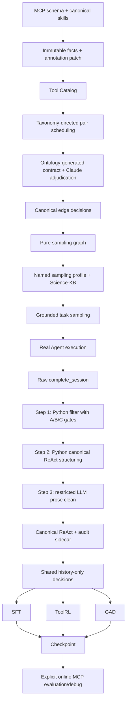

# Mainline

## 职责与唯一 authority

| 事实 | 唯一 authority | 其他模块的角色 |
| --- | --- | --- |
| MCP 明确的工具字段 | MCP schema 的确定性 snapshot | Tool Catalog 合并时保持 immutable |
| skills 中的工具语义摘要 | Tool-card Claude annotation patch | 只能注解已有 schema slot；skill-derived slot 必须独立并带 evidence |
| 是否调度 directed candidate | stage taxonomy 的 transition/alternative 规则 | Tool Card 字段只用于上下文、优先级与 audit |
| relation status/type 的受控词汇与结构约束 | `edge_ontology.yaml` | 运行时生成 pair prompt 片段与 output schema |
| directed relation status/type/mapping/evidence/confidence | Claude pair adjudication | Python 只拒绝结构/跨字段非法结果，不猜测或修复语义 |
| sampling graph | `graph.jsonl` 的确定性 projection | 只筛选可采样的 valid Claude decision，不改边语义 |
| Stage3 默认参数与 prompt | `question_sampling.yaml` 的 named profile | CLI 显式 flag 才覆盖 resolved profile，并记录 hash |
| grounded task validity | Tool-KG sampler + Science-KB + canonical graph | Data-Pipe 只检查可读性并执行 |
| task metrics / `aggregate_eligible` | `pipeline/evaluate/task_evaluator.py` | 只计算 benchmark 指标，不决定清洗准入 |
| `execution_valid`、`task_answer_valid`、`training_trace_valid` | `cleaning/python_clean.py` | `task_answer_valid` 只检查 `parsed_answer.parse_error`；LLM clean 只消费 Python audit |
| canonical ReAct draft、observation compaction/final construction | `cleaning/react_builder.py` | 每条 raw trace 只构造一次 |
| artifact/path 规范和 observation status 解释 | `cleaning/artifacts.py` | Python clean 唯一执行规范化 |
| final/observation 与跨消息 consistency findings | `cleaning/invariants.py` | 只读验证，不再次清洗或构造 |
| thought/final summary prose | restricted LLM patch | 只能修改 Python 标记的文本 segment |
| accepted/rejected | `cleaning/acceptance_gate.py` | 只投影 Python A/B/C gate；LLM 失败或静态 finding 不改变准入 |
| decision-state slicing / assistant decision parsing | `drug_agent/decision_extractor.py` | ToolRL、GAD 只派生方法字段 |
| ToolRL reward | `drug_agent.toolrl.molclaw_reward` | 只评价生成 action，不执行 |
| GAD negative/discriminator/reward | `drug_agent.gad` | 保留现有方法与权重 |
| real MCP execution | Data-Pipe executor 与显式 `tools_debug` | formal training 禁止调用 |

ToolRL 的 allowlist、GAD 的筛选策略和 tool registry 是方法策略或运行时 projection，不是新的工具语义 authority。

## 主线图

## Offline / online 边界

SFT 使用完整历史 teacher forcing；ToolRL 和 GAD 在固定历史 state 上生成下一步 action。生成 action 不会被执行，也不会取得新 observation。正式训练入口在启动 Ray 前加载 `offline_training_env.sh`，清除 MolClaw credentials，并由 MCP client/executor fail closed。

真实工具交互只允许在 Data-Pipe 执行层和显式 online debug 中发生。VS、AC、PF、E2E、KG
统一连接固定命名的 `molclaw-scp`，不保留 task-specific MCP server。
`debug_mcp_tools.py`、`debug_one_task.py` 与 `debug_replay_trajectory.py` 必须设置
`DRUG_AGENT_ALLOW_TOOL_ENV=1`。

Slime online inference 与 `debug_one_task.py` 可同时使用 MolClaw 和逐任务沙箱中的
`Read/Write/Edit/Bash/Grep/Glob/L1 Skill`。本地路径被限制在 sample workspace，L1
skills 只读，受限 Bash 不启动 shell 且禁止网络、解释器、删除、提权、进程控制与路径逃逸。
这不会改变 formal SFT、ToolRL、GAD 的 offline boundary 或 reward 定义。

## 显式兼容层

- Tool-KG 旧 graph views 与 CSV/GraphML 只通过 `legacy-views`、`legacy-export` 按需生成。
- 旧 `score`、`doc-chunks`、provenance/audit/log-evaluation/repro-manifest CLI 已删除；它们依赖重复或退役的 graph/debug 产物。
- Stage3 默认使用 `simple_default` profile 和 simple prompt；复杂 DAG/semantic repair prompt 位于 `prompts/legacy/`，必须显式选择 `dag_legacy`。
- 旧 `trajectory_exporter.py`、usage scanner、`post_process_sft.py`、独立 hard-clean/aggregate
  入口已删除；逻辑主线是 Python 筛选、Python 结构化、LLM clean。前两段由同一个
  `python_clean` 入口顺序执行，因此正式命令仍只有 `python_clean` 和 `llm_clean`。
- Data-Pipe KG adapter 默认只读 `results/tasks.jsonl`；历史 `sample_success*` 必须显式加 `--legacy-sample-results`。
- SFT、ToolRL、GAD 与 online replay 的默认输入都从 `$DRUG_AGENT_DATA_ROOT/react_trajectories.jsonl` 或其方法派生目录开始；`PROMPT_DATA`/`INPUT` 只用于显式覆盖。

OPD、VERL bundle、legacy action-JSON SFT 和 legacy online PPO/GRPO 不属于当前主线。

Python clean 先用 A/B/C gate 筛选，再把 canonical draft 和确定性 repair hints 交给 LLM；ground truth、benchmark
metrics 和 evaluator 结果只进入 audit。LLM 返回最小 patch，不能重写 tool call、observation、
prediction 或完整 trajectory。
