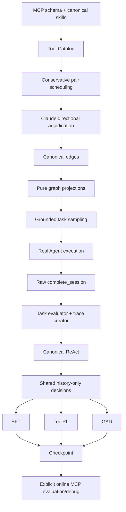

# Mainline

## 职责与唯一 authority

| 事实 | 唯一 authority | 其他模块的角色 |
| --- | --- | --- |
| MCP 明确的工具字段 | MCP schema 的确定性 snapshot | Tool Catalog 消费 |
| skills 中的工具语义摘要 | Tool-card Claude agent | Python heuristic 仅提示缺失信息 |
| directed relation status/type/context/evidence/confidence | Claude pair adjudication | candidate 只调度；canonical parser 只校验 |
| canonical edge | `canonical_edges.py` 对裁决结果的无修补解析 | calibration 可选且保留 raw confidence |
| graph view | `graph_views.py` | 纯阈值 projection，不改 edge 语义 |
| grounded task validity | Tool-KG sampler + Science-KB + canonical graph | Data-Pipe 只检查可读性并执行 |
| task metrics / `task_answer_valid` | `pipeline/evaluate/task_evaluator.py` | curator 消费结果 |
| `execution_valid`、`training_trace_valid`、MolClaw usage、accepted/rejected | `trace_curator.py` | 兼容入口只委托 |
| canonical ReAct | `trace_curator.py` | aggregator 仅去重和汇总 |
| decision-state slicing / assistant decision parsing | `drug_agent/decision_extractor.py` | ToolRL、GAD 只派生方法字段 |
| ToolRL reward | `drug_agent.toolrl.molclaw_reward` | 只评价生成 action，不执行 |
| GAD negative/discriminator/reward | `drug_agent.gad` | 保留现有方法与权重 |
| real MCP execution | Data-Pipe executor 与显式 `tools_debug` | formal training 禁止调用 |

ToolRL 的 allowlist、GAD 的筛选策略和 tool registry 是方法策略或运行时 projection，不是新的工具语义 authority。

## 主线图

## Offline / online 边界

SFT 使用完整历史 teacher forcing；ToolRL 和 GAD 在固定历史 state 上生成下一步 action。生成 action 不会被执行，也不会取得新 observation。正式训练入口在启动 Ray 前加载 `offline_training_env.sh`，清除 MolClaw credentials，并由 MCP client/executor fail closed。

真实工具交互只允许在 Data-Pipe 执行层和显式 online debug 中发生。`debug_mcp_tools.py`、`debug_one_task.py` 与 `debug_replay_trajectory.py` 必须设置 `DRUG_AGENT_ALLOW_TOOL_ENV=1`。

## 兼容层

- Tool-KG `score` 命令委托 canonical edge builder；不再二次打分。
- `trajectory_exporter.py`、`scan_molclaw_usage.py`、`post_process_sft.py` 保留旧入口形状，但 authority 都在 evaluator/curator。
- owner 已运行过的训练默认数据路径暂时保留；canonical 主线应显式传入 `PROMPT_DATA` 或 `INPUT`。修改这些默认值需 owner 确认。

OPD、VERL bundle、legacy action-JSON SFT、legacy online PPO/GRPO 和批量 LLM semantic repair 不属于当前主线。
