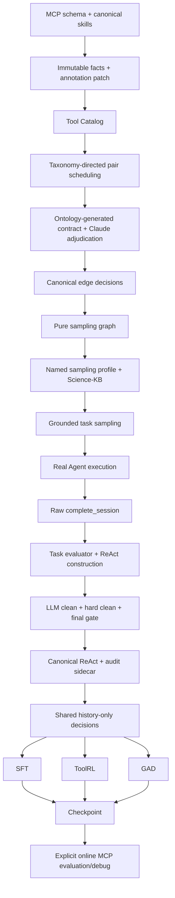

# Mainline

## 职责与唯一 authority

| 事实 | 唯一 authority | 其他模块的角色 |
| --- | --- | --- |
| MCP 明确的工具字段 | MCP schema 的确定性 snapshot | Tool Catalog 合并时保持 immutable |
| skills 中的工具语义摘要 | Tool-card Claude annotation patch | 只能注解已有 schema slot；skill-derived slot 必须独立并带 evidence |
| 是否调度 directed candidate | stage taxonomy 的 transition/alternative 规则 | Tool Card 字段只用于上下文、优先级与 audit |
| relation status/type 的受控词汇与结构约束 | `edge_ontology_v1.yaml` | 运行时生成 pair prompt 片段与 output schema |
| directed relation status/type/mapping/evidence/confidence | Claude pair adjudication | Python 只拒绝结构/跨字段非法结果，不猜测或修复语义 |
| sampling graph | `graph.jsonl` 的确定性 projection | 只筛选可采样的 valid Claude decision，不改边语义 |
| Stage3 默认参数与 prompt | `question_sampling_v2.yaml` 的 named profile | CLI 显式 flag 才覆盖 resolved profile，并记录 hash |
| grounded task validity | Tool-KG sampler + Science-KB + canonical graph | Data-Pipe 只检查可读性并执行 |
| task metrics / `task_answer_valid` | `pipeline/evaluate/task_evaluator.py` | KG/E2E 只读 final prediction 与 task contract，不读取 execution |
| `execution_valid`、`training_trace_valid`、MolClaw usage | `trace_curator.py` | acceptance gate 消费 |
| canonical ReAct construction、首次 observation compaction/final construction | `react_constructor.py` | hard clean 不二次构造或压缩 |
| artifact/path 规范和 observation status 解释 | `cleaning/primitives.py` | constructor 首次规范化；hard clean 在 LLM 后复用同一纯函数 |
| final/observation 与跨消息 consistency findings | `cleaning/hard_cleaner.py` | 只报告 findings，不改写最终样本状态 |
| accepted/rejected/quarantine | `cleaning/acceptance_gate.py` | evaluator、LLM clean、hard clean 只提供事实/findings |
| decision-state slicing / assistant decision parsing | `drug_agent/decision_extractor.py` | ToolRL、GAD 只派生方法字段 |
| ToolRL reward | `drug_agent.toolrl.molclaw_reward` | 只评价生成 action，不执行 |
| GAD negative/discriminator/reward | `drug_agent.gad` | 保留现有方法与权重 |
| real MCP execution | Data-Pipe executor 与显式 `tools_debug` | formal training 禁止调用 |

ToolRL 的 allowlist、GAD 的筛选策略和 tool registry 是方法策略或运行时 projection，不是新的工具语义 authority。

## 主线图

## Offline / online 边界

SFT 使用完整历史 teacher forcing；ToolRL 和 GAD 在固定历史 state 上生成下一步 action。生成 action 不会被执行，也不会取得新 observation。正式训练入口在启动 Ray 前加载 `offline_training_env.sh`，清除 MolClaw credentials，并由 MCP client/executor fail closed。

真实工具交互只允许在 Data-Pipe 执行层和显式 online debug 中发生。`debug_mcp_tools.py`、`debug_one_task.py` 与 `debug_replay_trajectory.py` 必须设置 `DRUG_AGENT_ALLOW_TOOL_ENV=1`。

## 兼容层

- Tool-KG `score` 命令委托 canonical edge builder；旧 graph views/CSV/GraphML 只按需导出。
- `doc-chunks` 仅保留为显式 debug/index 命令，不属于 Stage1 或默认 `run-all`。
- Stage3 默认使用 `simple_default` profile 和 simple prompt；复杂 DAG/semantic repair prompt 位于 `prompts/legacy/`，必须显式选择 `dag_legacy`。
- `trajectory_exporter.py`、`scan_molclaw_usage.py`、`post_process_sft.py` 保留旧入口形状，但 authority 都在 evaluator/curator。
- Data-Pipe KG adapter 默认只读 `results/tasks.jsonl`；历史 `sample_success*` 必须显式加 `--legacy-sample-results`。
- SFT、ToolRL、GAD 与 online replay 的默认输入都从 `$DRUG_AGENT_DATA_ROOT/react_trajectories.jsonl` 或其方法派生目录开始；`PROMPT_DATA`/`INPUT` 只用于显式覆盖。

OPD、VERL bundle、legacy action-JSON SFT 和 legacy online PPO/GRPO 不属于当前主线。

ReAct constructor 和 LLM clean 的输入不包含 ground truth、benchmark metrics 或 evaluator
结果。question record 只投影推理时可见的 task input；reference labels 仅进入 audit
sidecar，不能回流到训练 messages。
