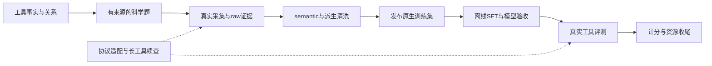

# Drug-Pipe：按目标审流程

这份审阅配合流程图使用。您不必逐个文件看实现，重点是确认：每一步为什么存在、交付什么、哪些保证已经落在代码里，以及哪些边界仍需要您决定。阅读依据是当前集成源码；图中的“已实现”指有对应逻辑，不代表全部历史数据已经修好、服务此刻在线或模型效果已经提升。

整条主线的目标是：利用科学工具关系构造有真实输入的问题，保存实际求解证据，再形成适合学生模型部署协议的训练示范，最后用真实工具任务检验收益。项目已经投入大量工程处理调用身份、来源绑定、失败保留、长上下文、有限恢复和资源收尾。这些工作保证过程可追踪；科学结论是否充分，仍须单独判断。

| 流程 | 输入 → 输出 | 已做的关键投入与注意点 |
|---|---|---|
| 理解工具 | MCP schema、skill → 工具卡 | 参数事实由schema确定，Agent只补有引用的语义；未知信息保留。 |
| 判断关系、生成问题 | 工具卡、有效边、知识库 → 公开题面及内部蓝图 | 候选调度与边裁决分开；有来源的输入、有限修复、独立attempt。 |
| 真实采集 | 公开问题 → raw会话、工具结果、产物 | 执行目录与标签sidecar分开；工具准入、MCP就绪检查、原始字节与hash留存。 |
| 构造semantic | raw → 模型无关的决策/观察序列 | 按真实响应和调用ID还原边界，保留失败历史，压缩观察时保护后续使用的证据。 |
| 派生清洗 | semantic → 原生skill示范、reasoning修订 | 限定可改字段；补入的skill步骤标为派生；终答恢复与科学重构分清。 |
| 发布训练输入 | 清洗视图 → structured SFT release | 检查heldout、工具schema、真实tokenizer和角色mask；完整轨迹超长则留审计、排除训练。 |
| SFT | 固定release → checkpoint、HF模型 | 长度分档probe、保存重载、完整epoch及逐步数值检查；最终模型验收与probe验收分开。 |
| 真实工具评测 | 模型、冻结题集、skill → 逐题轨迹 | 训练与工具执行隔离；检查模型实际看到的协议，网络续查保持同一计算身份。 |
| 计分与收尾 | 原始attempt → 可复算指标、退出证据 | 有限基础设施补跑，不按成绩选attempt；失败分母、可发布状态和GPU释放分别记录。 |

下面六项决定的是业务边界，暂不要求重构或重跑。若现有行为符合您的意图，保留并写清适用范围即可；只有与目标不一致的部分才进入改动清单。

1. **题面出现工具名或顺序提示，能否作为正式训练题？** 目前hidden toolchain泄露只记soft warning，仍可生成成功task。建议先区分“自然科学问题中必要的方法名”和“直接给出解题步骤”，由您确定后者是保留、单列教学数据，还是不进入自主规划训练。这里不会据一个关键词就判所有题目无效。锚点：[tool-kg/src/molclaw_kg/question_sampling/simple_sampler.py:608](https://github.com/mu9enn/drug-pipe/blob/d54ba74cda6cf7bbfbddf59320d30f5c05b013a8/tool-kg/src/molclaw_kg/question_sampling/simple_sampler.py#L608)。

2. **探索性KG/E2E样本，要满足什么证据才算完成题目？** 当前通用评估主要检查有结果内容及必要字段，尚不通用验证指定方法、要求数量、产物内容和数值回指。请确定正式训练示范是否必须逐项满足题面，还是允许明确标注局限的探索性结果；已授权的改题、补真实计算可以继续，但要按新题验收，不能把旧题的缺口写成完成。锚点：[data-pipe/pipeline/evaluate/task_evaluator.py:291](https://github.com/mu9enn/drug-pipe/blob/d54ba74cda6cf7bbfbddf59320d30f5c05b013a8/data-pipe/pipeline/evaluate/task_evaluator.py#L291)。

3. **第一阶段LLM清洗失败、原终答仍合规时，是否保留训练资格？** 当前会保留并标warning；第二阶段长reasoning修订失败则进入pending，而且处理一次并不保证压到目标长度。建议您确认这两种失败是否继续区别对待，以及warning是否需要抽审或单列统计。没有证据时不把“清洗调用失败”等同于“原样本坏了”。锚点：[data-pipe/pipeline/cleaning/llm_clean.py:293](https://github.com/mu9enn/drug-pipe/blob/d54ba74cda6cf7bbfbddf59320d30f5c05b013a8/data-pipe/pipeline/cleaning/llm_clean.py#L293)、[data-pipe/pipeline/cleaning/reasoning_shorten.py:199](https://github.com/mu9enn/drug-pipe/blob/d54ba74cda6cf7bbfbddf59320d30f5c05b013a8/data-pipe/pipeline/cleaning/reasoning_shorten.py#L199)。

4. **迁移、改题、补采和修订，怎样判断仍是同一个源样本？** 当前semantic ID含物理路径，搬目录可能换ID；heldout隔离支持显式source ID，但依赖上游正确提供。建议以稳定源身份把原版、重采和派生版本归为一组，再决定替换、保留及训练/测试去向。请确认“同源分组”优先于文件名和release名，避免不同窗口各自发布后重复纳入。锚点：[data-pipe/pipeline/cleaning/python_clean.py:97](https://github.com/mu9enn/drug-pipe/blob/d54ba74cda6cf7bbfbddf59320d30f5c05b013a8/data-pipe/pipeline/cleaning/python_clean.py#L97)、[data-pipe/pipeline/benchmark_release.py:135](https://github.com/mu9enn/drug-pipe/blob/d54ba74cda6cf7bbfbddf59320d30f5c05b013a8/data-pipe/pipeline/benchmark_release.py#L135)。

5. **哪些评测入口应承担统一的启动保证？** 运行目录的新方案要求MCP完整初始化、工具目录与本次token都验证后才申请GPU；仓库通用CPU入口仍以HTTP200和空ready文件判断。请确定是把新保证收进所有仍支持的正式入口，还是明确旧入口仅保留历史复现。这个决定关乎新clone能否复现当前行为，不意味着已经完成的评测必须全部重跑。锚点：[docs/decisions/2026-09-22-v9-evaluation-lifecycle.md:11](https://github.com/mu9enn/drug-pipe/blob/d54ba74cda6cf7bbfbddf59320d30f5c05b013a8/docs/decisions/2026-09-22-v9-evaluation-lifecycle.md#L11)、[slime-wd/dsh-molbench/pretrained_matrix/run_cpu_eval.py:53](https://github.com/mu9enn/drug-pipe/blob/d54ba74cda6cf7bbfbddf59320d30f5c05b013a8/slime-wd/dsh-molbench/pretrained_matrix/run_cpu_eval.py#L53)。

6. **采集并发预算由一个controller负责，还是允许跨机共同运行？** 现有工具claim依据预计工具链，只在单个controller内协调；它不构成跨窗口、跨主机的全局工具锁。若正式生产保持单controller，可以继续用现有简单机制；若要多controller并行，请先决定总预算和所有者，再判断是否需要协调实现，不预先建设复杂调度系统。锚点：[data-pipe/pipeline/kg/tool_admission.py:55](https://github.com/mu9enn/drug-pipe/blob/d54ba74cda6cf7bbfbddf59320d30f5c05b013a8/data-pipe/pipeline/kg/tool_admission.py#L55)、[data-pipe/pipeline/claude_agent/run_claude.py:1192](https://github.com/mu9enn/drug-pipe/blob/d54ba74cda6cf7bbfbddf59320d30f5c05b013a8/data-pipe/pipeline/claude_agent/run_claude.py#L1192)。

审阅结果可以只记录“保留现状、补清说明、需要改变”及理由。历史数据条数、某次worker名称和一轮成绩留在运行状态里，不提升为永久业务规则。旧ToolRL/GAD是独立研究支线，不作为当前structured SFT必须经过的阶段；暂未继续的部分也不自动视为取消。

## 阅读范围

基线：`d54ba74cda6cf7bbfbddf59320d30f5c05b013a8`。分析88个关键入口、契约、检查与上下文文件，代码图237节点/539关系/8层，导览10步；业务流程图用于默认高层阅读。没有展开通用Slime/DSH vendor内部实现、机器私有运行脚本、真实数据及模型权重。`tested_by`仅表示静态测试关联，不保证测试已通过；旧XML validator测试失效已明确标注。
