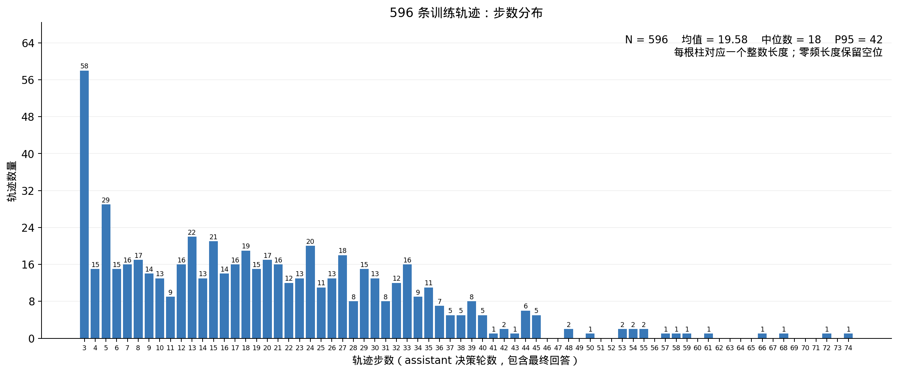
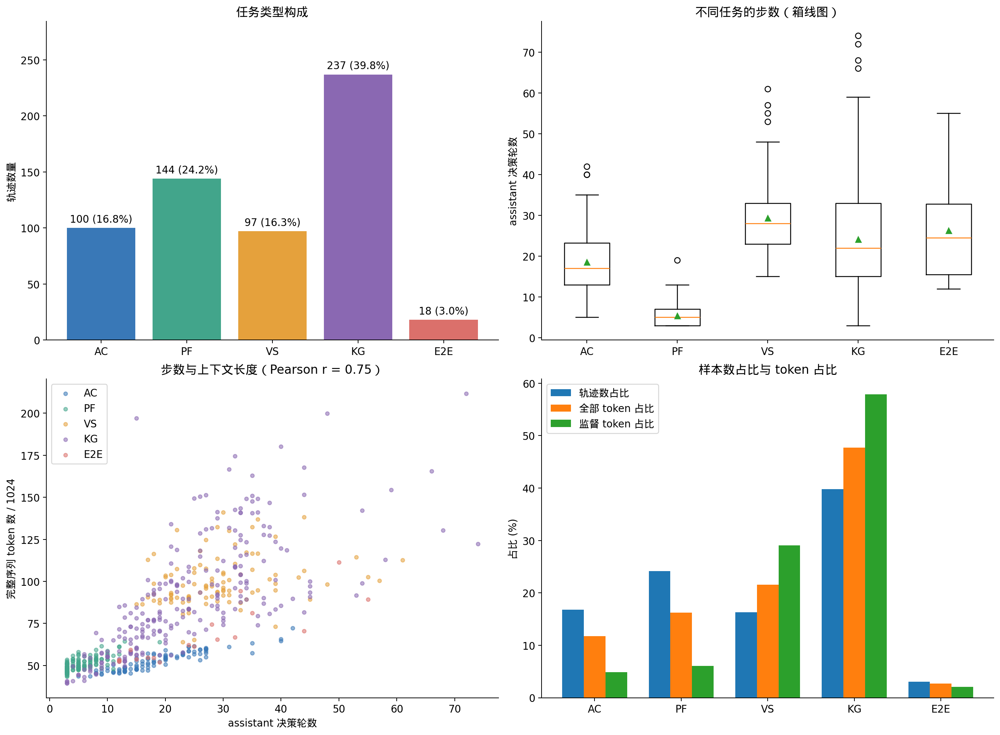
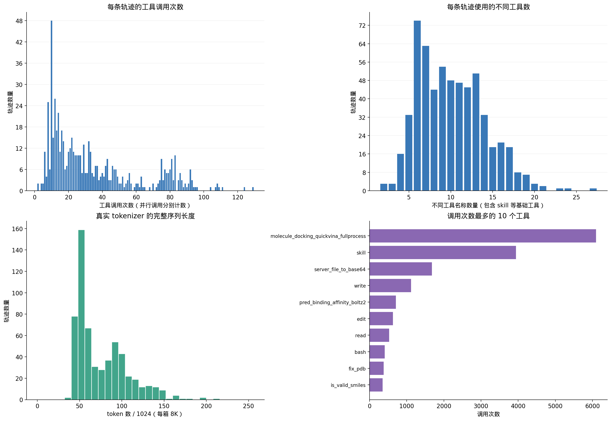

# 596 条训练轨迹统计

数据源：`/mnt/shared-storage-user/sdpdev-fs/sunxiangyu/drug_wd/drug_pipe_regular_v1_20260908`。训练文件、semantic 文件和 token gate manifest 的 SHA-256 均已核对发布清单。

## 统计口径

- 主图每一个整数步数对应一根柱。一步为一条 assistant 消息，与 semantic assistant_decision 事件逐条核对；包含 skill 调用及最终回答，不计 system、user、tool 返回。同一轮多个工具调用算一步。
- 工具调用数按实际 tool_calls 元素计数，包含 skill/read/write 等基础工具；同时核对 semantic 观察数和 SFT tool 消息数。
- token 来自发布时真实 Qwen tokenizer / qwen3_5 loss mask 的 record_lengths，只选择本训练集 596 个 ID；没有重新 tokenize。完整序列含系统、catalog、工具返回等，监督 token 以 loss mask 为准。
- 分析对象为清洗、技能补充和长度门控后的训练轨迹，不代表原始 teacher 执行长度。599 条 semantic 中的 3 条超长轨迹不计入统计。
- 分位数采用 NumPy 默认线性插值；工具报错仅统计 semantic 的 is_error=true 或 status=error，可能漏掉嵌在正文内的失败，不能当作科学答案正确率。

## 步数

|指标|数值|
|---|---:|
|count|596.00|
|total|11669.00|
|min|3.00|
|mean|19.58|
|median|18.00|
|p90|36.00|
|p95|42.00|
|max|74.00|

## 任务与长度

|任务|轨迹数|平均步数|中位步数|总 token|监督 token|
|---|---:|---:|---:|---:|---:|
|AC|100|18.57|17|5,396,583|691,819|
|PF|144|5.39|5|7,470,659|863,707|
|VS|97|29.33|28|9,933,388|4,131,115|
|KG|237|24.12|22|21,957,080|8,225,920|
|E2E|18|26.33|24.5|1,238,759|292,845|

## 工具与 token

- 工具调用共 20,428 次，覆盖 84 种工具；加载 52 种 skill。
- 568 条轨迹存在一轮多个工具调用。
- 全部 token 45,996,469；监督 token 14,205,406，加权监督占比 30.88%。
- 最长的 60 条（约 10%）轨迹占全部 token 的 18.90%。
- 显式报错观察 2,072 条，分布于 365 条轨迹；报错可能被后续修复，不等于轨迹失败。

|上下文容量|可完整容纳轨迹数|覆盖率|
|---|---:|---:|
|16,384|0|0.00%|
|32,768|0|0.00%|
|65,536|306|51.34%|
|131,072|552|92.62%|
|245,760|596|100.00%|

## 进一步可做

- 对训练采样检查任务数量与监督 token 占比的差异；按轨迹均匀采样不等于各任务监督量均衡。
- 利用逐条 CSV 选择短、中、长轨迹及不同工具覆盖的开发验证样本；本报告未修改数据划分。
- 若要评估科学质量，需要独立核验最终答案、证据支持度与失败恢复；不能从轨迹长度或工具是否返回推断正确率。

## 复现与文件

`python analyze.py`（需要 numpy、matplotlib 和系统 Droid Sans Fallback 字体）。
`trajectory_metrics.csv` 为逐轨迹明细，`step_frequency.csv` 为每个整数步数的频数，`task_summary.csv`、`tool_usage.csv`、`skill_usage.csv` 为分类汇总，`summary.json` 包含数值和来源哈希。所有图同时导出 PNG/SVG。
